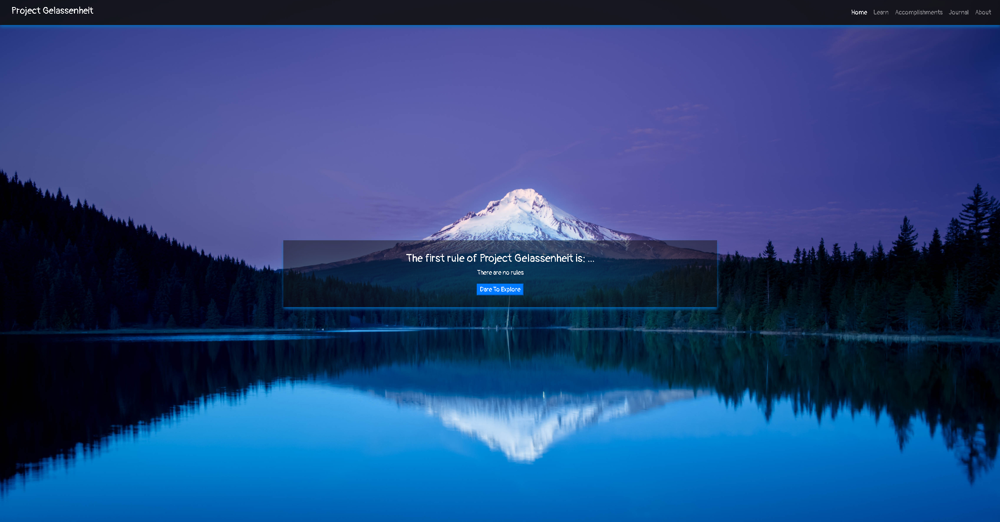
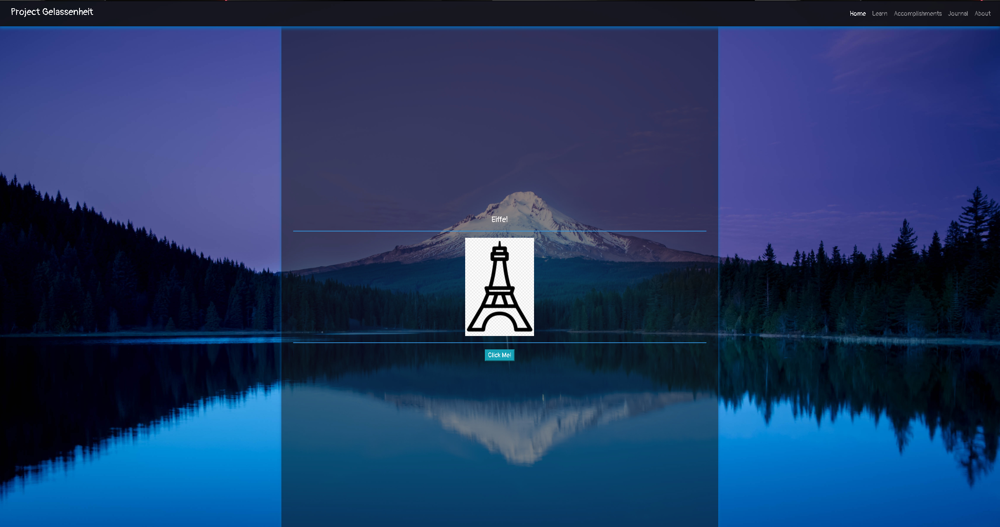
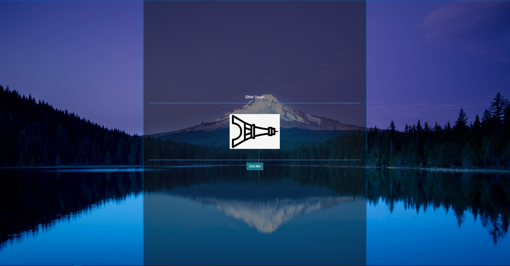
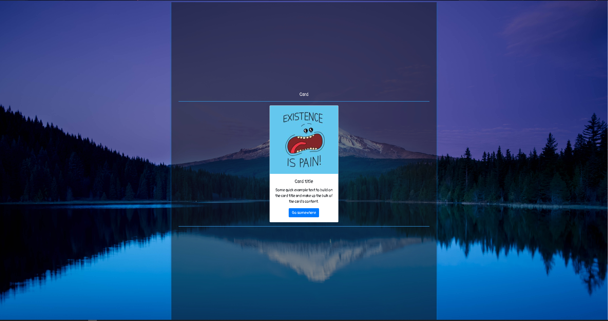
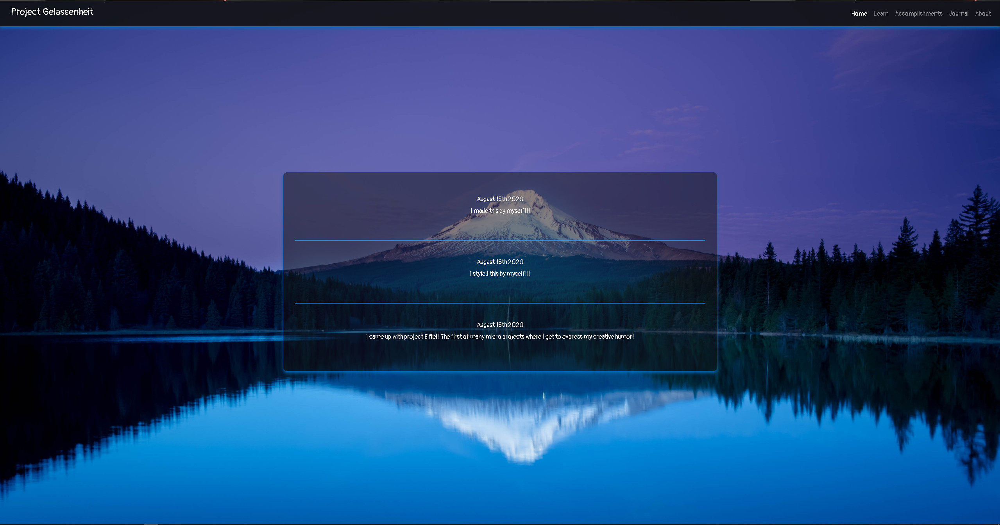
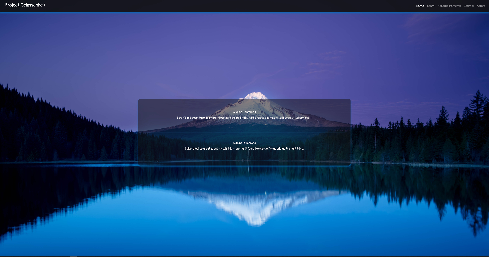
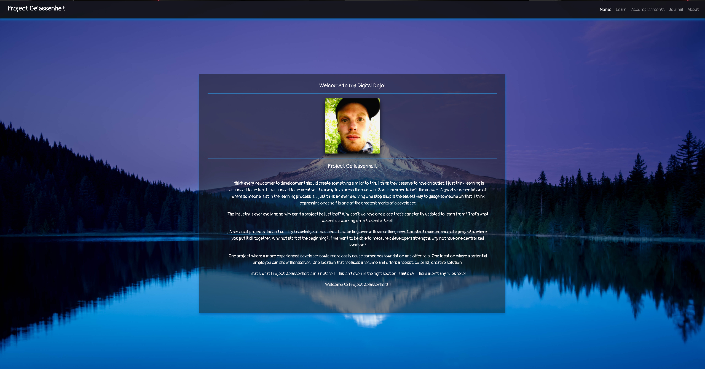

# Project-Gelassenheit

Heres the purpose...

Gelassenheit is German for serenity. I just want a space away from the noise.

One of the most detrimental things to the learning process involved in development for me has been based on some advice I see used heavily.

That advice is to make something a business could use.

Learning is supposed to be fun.

I just want a place where there are no rules.

A place where things don't have to be anything but what you make them.

I want a place to let my creativity run free and a place where its ok to render something just for the sake of rendering it.

Project Gelassenheit is an evolving projection of myself.

This is where I get to rock my unique personality. This is where 2 + 2 = 5. I'm in charge here and I'm going to have fun with it.

This is where I divide by 0.

For now the purpose of the main page is to focus on things I want to learn. All other pages are meant for supplemental outlets.

Welcome to Project Gelassenheit!!!

# Project-Eiffel

The first micro project I brewed up.

It takes my sense of humor and creativity to spin off a simplistic approach to learning event handlers, React Hooks, state management...and well...Whatever else I decide to incorporate...because there are no rules here!!!

The idea is to wire an event handler to the onClick property of the button to rotate the image of the eiffel tower 90 degrees to the right. It will also inject a string held as "text" by the useState hook to inject the word "down" inside of the h5 tag that currently contains the word "Eiffel". So..."Eiffel Down"...🤣🤣🤣

# Project-Card

The idea here is simply to have the button onClick event modify the card details. I'll let you guess where this pun is going 😁.

# Project Uni-poll-ar

I'm a secret because I can be.  There aren't rules here!!!

# Accomplishments

It's important to celebrate our wins no matter how big or small. Project Gelassenheit has a place for that!

# Journal

It's important to reflect on our thoughts. It's important to keep our mental health in check. Project Gelassenheit has a place for that!

# About

I just think the boot camp I took had a "cart before the horse" approach to things. I think if you are going to learn to code then you should learn just that. The raw form. Without worrying about the what if's. Without worrying about whether or not your creation serves a purpose outside of it serving your learning process. Being professional isn't hard. Learning to code is. I think there should be a place that fosters ones creativity. That's what a coder is. It's solving puzzles. It's thinking outside the box. It's the ability to create the impossible. This is my canvas to do just that.
